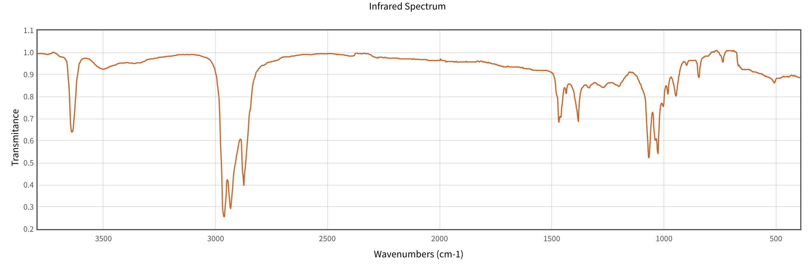

# Project Plan Intro to DS DATA 201!
## Overview 
The goal of this project is to train different machine learning algorithms to interpret of Infrared Absorbance Spectra of different chemical systems and assess the accuracy of different models. IR Absorbance spectra have been used in chemistry for many decades as a means of identifying specific functional groups in molecules. In this approach chemical structures can be thought of as Lego sets and the IR spectra reveals useful information about which pieces are used. Because each specific "piece" (for instance a C double-bonded to an O) has a different infrared absorbance (corresponding to bond vibration energies) the infrared spectra can be used to glean valueable information about key features present in a molecular system. 

For Example the IR absorbance spectra for n-butanol shows a number of useful features corresponding to the different functional groups in Butanol (CH3-CH2-CH2-CH2-OH): 

Specifically, the sharp peak at ~3500 cm^-1 corresponds to the O-H stretch of the alcohol and the broad peaks at ~3000 cm^-1 correspond to the CH stretches. Note that a functional group is a multi-label classifier (ie. one compounds IR spectra often can indicate the presence of multiple functional groups). 

## Data Collection 

In order to train a ML model to recognize these IR features and map them to functional groups we need a basis set of chemical systems and functional groups of interest. To limit the scope of and computational cost of this project we will focus on small organic molecules (less than 25 atoms of just C,N,H,O,Cl, Br). We will also focus on the following functional groups (C-H, C=C, C≡C, C≡C-H C≡N, C-OH, C=O, C=OOH, and N-H). 

Another issue is the lack of mass-downloadable data for IR Spectra, meaning that digitized spectra will have to be downloaded manually from the NIST webbook. As such, 100 Spectra were specifically chosen to form the training set (and accurately capture the functional gropups of interest). These spectra include 40 Systems with only one main functional group (and C-H) and 10 that mix different functional groups together. An additional 10 spectra will be used as a test set to assess model accuracy. 

For more information about this project please refer to the project_report.pdf which contains related figures, tables, and text regarding different model performances, implementation details, and general discussion. 

## File Descriptions

This repository contains three codes: "load.ipynb", "project_implementation", and "spectrum_interpret.py". 

"load.ipynb" contains the code necessary to convert *.JCAMP files into the csv file "Full_File.csv" including normalization and interpolation to bin energy values. 

"project_implementation" is a jupyter notebook showing the data science machine learning pipeline used to conduct this study as well as an assortment of tables and figures including correlation analysis, performance scores, and importance features. 

"spectrum_interpret.py" is an object oriented version of the project allowing users more control over which models to fit and data to load. This code can be imported and lets you use my machine learning visualization and fitting approach on your own IR absorbance spectra. 

## Dependencies
- Python 3.x
- Jupyter Notebook
- Sci-Kit Learn 
- Scipy 
- Matplotlib

All data are sourced from NIST Webbook: https://webbook.nist.gov/chemistry/

